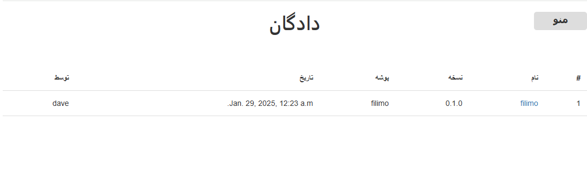
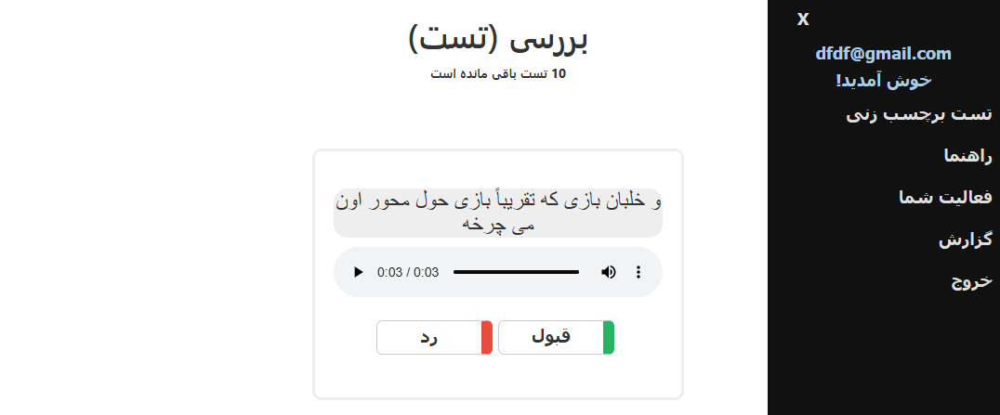
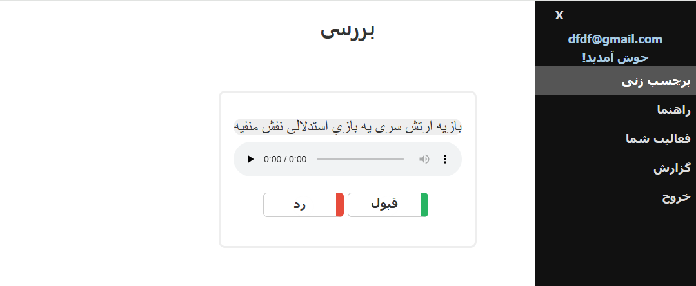
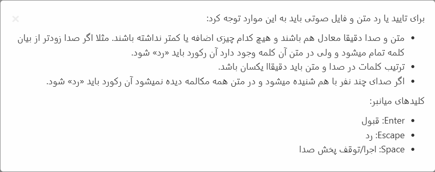
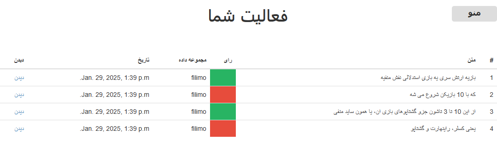
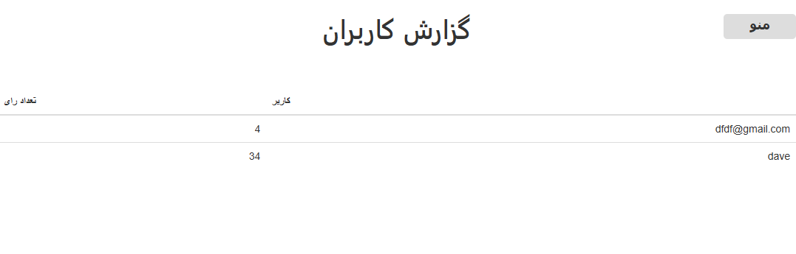
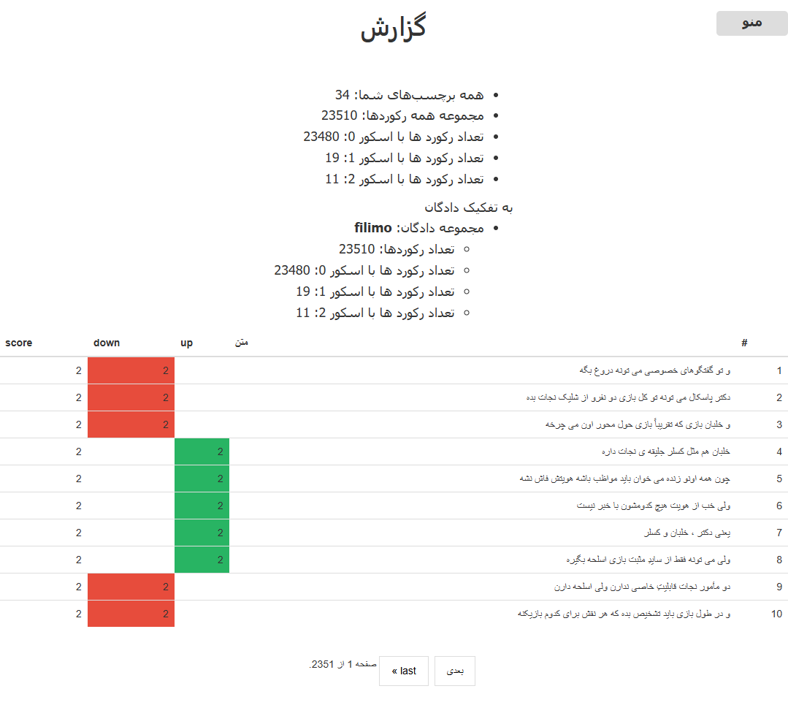

# AnnoTitan
It is a web-based Automatic Speech Recognition data verifier that uses a crowd-sourcing model.

## Description

This application is designed for verifing ASR datasets like [Youtube Persian ASR dataset](https://huggingface.co/PerSets/youtube-persian-asr) and [Filimo ASR dataset](https://huggingface.co/PerSets/filimo-persian-asr), but it can also be used for any other similar datasets.

## Start up the app

Follow these steps:
- Add a `.env` file with the following key/value pairs to the root of the app.
```
SECRET_KEY=A_LONG_STRING _AS_DJANGO_KEY
DB_NAME=YOUR_POSTGRESS_DB_NAME
DB_USER=YOUR_DB_USER
DB_PASS=YOUR_DB_PASS
DB_PORT=YOUR_DB_PORT
DB_HOST=YOUR_DB_SERVICE_NAME in docker-compose.yml (here is 'db')
MEDIA_FOLDER="media/"
MEDIA_VOLUME="/media"
ADMIN_ROUTE="admin/"
#EMAIL_HOST=YOUR_EMAIL_HOST
#EMAIL_PORT=YOUR_EMAIL_PORT
#EMAIL_USER=YOUR_EMAIL_USER
#EMAIL_PASS=YOUR_EMAIL_PASS
USE_EMAIL_VERIFICATION='False'
ALLOWED_HOSTS='["localhost", "127.0.0.1","0.0.0.0", ]'
CSRF_TRUSTED_ORIGINS='[""]'
NGINX_CONF='./nginx/local_nginx.conf:/etc/nginx/conf.d/default.conf:ro'
DEBUG='True'
SPLIT_PREFIX=unvalidated
SCORE_THRESHOLD=2
```
- Put each dataset in a folder in `media` directory at the app root. This dataset folder should consist of archives and metadata file.
    ```
    app_root_directory
    |
    ├───media
    │   └───filimo
    |       ├───unvalidated.csv
    │       └───data
    |           ├───unvalidated_001.tar
    |           |          ...
    |           |          ...
    |           └───unvalidated_033.tar
    ```

- Run the app with `docker-compose.yml`
    ```
    docker compose up -d
    ```

- Start an interactive shell inside `web` container (Django container)

    ```
    docker exec -it <CONTAINER_NAME> /bin/bash
    ```

    - Migrate Django database models (inside interactive shell)

    ```
    python manage.py migrate
    ```
    - Create Django super user (inside interactive shell)
    ```
    python manage.py createsuperuser
    ```

    - Go to localhost/admin and login to admin panel with your superuser user/pass
    - Select `Add` in `Datasets` row
    - Enter `filimo` or `youtube` (based on your dataset) in name and data folder fields. Select current date and time and finally set Added by field and save.
    - Activate dataset by going to `Active dataset` row and select add. From dropdown menu select `filimo` and save.

    - In the Django shell use `shellutil.py` script to load audio from archives and pair them with metadata in the database.
    ```
    python manage.py shell
    ```
    inside Django shell:
    ```
    >>> from shellutil import load_all_datasets
    >>> load_all_datasets()
    ```
    and wait until all records of csv and audio path added to the db. For checking if everything is done correctly, number of records should equal to the dataset.
    ```
    >>> from asrann.models import Record 
    >>> Record.objects.count()
    ```
    - Go to the app page `localhost`. You should see following page.

    

    - Now two final steps; go to `localhost/admin`, login and go to your user record page, find `user_tested` and check it, then find `score weight` field and increase it to 2, save it.
    - Now start annotating at least 10 records. It makes enough ground truth records for Test Phase (`تست برچسب‌زنی`) for other regular users. If you do not make these ground truth records, there are no records for Test Phase and the regular users see nothing when they click on `تست برچسب زنی`.

## Run locally or on the web
`AnnoTitan` is a self-sufficient app that you can run locally or on the web. If you run it on the web, you would like to verify the users who register to contribute to annotating your data, to do so make sure `USE_EMAIL_VERIFICATION` is set to True in .env and then add your SMTP email account to the `.env` file for the user verification process (`EMAIL_HOST`, `EMAIL_PORT`, `EMAIL_USER`, `EMAIL_PASS`).

If you run locally you can set `USE_EMAIL_VERIFICATION` to False for sure. Delete other fields related to email in `.env` file (`EMAIL_HOST`, `EMAIL_PORT`, `EMAIL_USER`, `EMAIL_PASS`).

## SCORE_THRESHOLD and score_weight
SCRE_THRESHOLD is the threshold that we define in .env and any records score field must meet this to be considered as an annotaed record. 

score_weight is the score that each user add to the score of each record he/she voted. By default each user has a score_weight of 1 but it can be changed by the superuser.

For SCORE_THRESHOLD of let say 2, records must reach 2 or -2 to considered annotated, which means each record needs at least two vote with score_weight of 1 or one vote with score_weight of 2.

For simplicity and fast annotating you can set SCORE_THRESHOLD to 1, so each record becomes annotated with just one vote.

## How to use
Each user should pass Test Phase (unless for the superuser which we set its `user_tested` field to True before).


After passing 10 test, the real Annotation Phase began.



The `راهنما` menu shows instructions on how and what to `accept` or `reject` in records. It shows also keyword shortcuts for fast annotating.



The `فعالیت شما` menu shows all your previous annotations and you can review and change them if needed.



The `گزارش کاربران` shows each user number of votes. The superuser sees all users but the admin sees only other admins and regular users activity. This option limited to superusers and admins.



The `گزارش` shows a summary of all records, annotations and total weights for a record. It shows also the list of votes and their scores. This option limited to superusers and admins.

